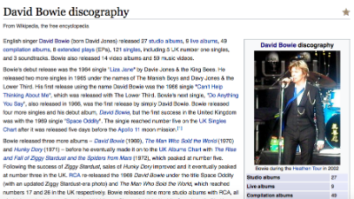

# Scraper #1: Start scraping in 5 minutes

In this chapter I want to show you just how quickly you can get a simple scraper running - but along the way start exploring some key concepts which you'll need as you start to work on different challenges and more advanced scrapers.

You can write a very basic scraper by using Google Drive, selecting **Create>Spreadsheet**, and, in one of the cells on that new spreadsheet, typing a formula *like* this (we'll adapt it in a moment). It doesn't matter where you type it:

`=ImportHTML("ENTER THE URL HERE", "table", 1)`

This formula will go to the **URL** you specify inside those quotation marks, look for a **table**, and pull the **first one** into your spreadsheet.

E>*If you're using a Portuguese, Spanish or German version of Google Drive - or have any problems with the formula - use semi colons instead of commas. We're using commas here because this convention will continue when we get into programming in later chapters.*

Let's imagine you want to get an overview of the discography of a particular artist: you could use this formula by typing it into the first cell of an empty Google Drive spreadsheet and replacing `"ENTER THE URL HERE"` with `"https://en.wikipedia.org/wiki/David_Bowie_discography"`.

Try it and see what happens. It should look like this:

`=ImportHTML("https://en.wikipedia.org/wiki/David_Bowie_discography", "table", 1)`

W>*Don't copy and paste this - it's always better to type directly to avoid problems with hyphenation and curly quotation marks, etc.*

After a moment, the spreadsheet should start to pull in data from the first table on that webpage.

So, you've written your first scraper! That didn't take long at all. Now, it *is* a very basic one, and we might want to change some things about it, but by understanding how it works and building on it you can start to make more and more ambitious scrapers with different languages and tools.

## How it works: functions and parameters

Let's break this formula down:

`=ImportHTML("https://en.wikipedia.org/wiki/David_Bowie_discography", "table", 1)`

The scraping formula above has two core ingredients: a **function**, and **parameters**:

+ `importHTML` is the **function**. Functions (as you might expect) *do* things. [According to Google Drive's Help pages](https://support.google.com/docs/answer/3093339) this one "Imports data from a table or list within an HTML page"
+ All the items within the parentheses (brackets) are the **parameters**. Parameters are the *ingredients* that the function needs in order to work. In this case, there are three: a URL, the word `"table"`, and a number `1`.

You can use different functions in scraping to tackle different problems, or achieve different results. Google Drive, for example, also has functions called `importXML`, `importFeed` and `importData` - some of which we'll cover later. And if you're writing scrapers with languages like Python, Ruby, R or PHP you can create your own functions that extract particular pieces of data from a page or PDF (which we'll also cover in later chapters).

## What are the parameters? Strings and indexes

Back to the formula:

`=ImportHTML("https://en.wikipedia.org/wiki/David_Bowie_discography", "table", 1)`

In addition to the function and parameters, it's important to explain some other things you should notice:

+ Firstly, the `=` sign at the start. This tells Google Drive that this is a **formula**, rather than a simple number or text entry
+ Secondly, notice that two of the three parameters use straight quotation marks: the URL, and `"table"`. This is because they are **strings**: strings are basically words, phrases or any other collection (i.e. _string_) of characters. The computer treats these differently to other types of information, such as numbers, dates, or cell references - we'll come across these again later
+ The third parameter does not use quotation marks, because it is a number. In fact, in this case it's a number with a particular meaning: an **index** - the position of the table we're looking for (first, second, third, etc)

Knowing these things helps both in avoiding mistakes (for example, if you omit a quotation mark or use curly quotation marks it won't work) and in adapting a scraper...

For example, perhaps the table you got wasn't the one you wanted. Indeed, the first table on that webpage is a general list of the number of studio albums, live albums, and so on, that he recorded. But perhaps we want the table which goes into more detail on each album and how they charted.

Try replacing the number `1` in your formula with a number `2`. This should now scrape the second table (in Google Drive an index starts from 1):

`=ImportHTML("https://en.wikipedia.org/wiki/David_Bowie_discography", "table", 2)`

You should now see the second table from that URL appear (if there is no second table, you will get an `#N/A` error).

### Documentation and cell references

Knowing to search for information (often called '**documentation**') on a function is important too. [The page on Google Drive Help](https://support.google.com/docs/answer/3093339), for example, explains that we can use `"list"` instead of `"table"` if you wanted to grab a list from the webpage.

So try that, and see what happens (make sure the webpage has a list).

`=ImportHTML("https://en.wikipedia.org/wiki/David_Bowie_discography", "list", 1)`

You can also try replacing either string with a cell reference. For example:

`=ImportHTML(A2, "list", 1)`

In this case it will look in cell A2 for the URL instead. So in cell A2 type or paste:

`https://en.wikipedia.org/wiki/David_Bowie_discography`

Notice that *you don't need quotation marks around the URL if it's in another cell*.

Using cell references like this makes it easier to change your formula: instead of having to edit the whole formula you only have to change the value of the cell that it's drawing from.

For examples of scrapers that do all of the above, [see this example](https://docs.google.com/spreadsheet/ccc?key=0ApTo6f5Yj1iJdDBSb0FPQm9jUjYzdjcyNWlUTjVYMFE).

W> Although this is described as a 'scraper' the results only exist as long as the webpage does. The advantage of this is that your spreadsheet will update every time the page does.
W>
W> The disadvantage is that if the webpage disappears, so will your data. So it's a good idea to keep a static copy of that data in case the webpage is taken down or changed. You can do this by selecting all the cells and clicking on **Edit>Copy** then going to a new spreadsheet and clicking on **Edit>Paste values only**.

## Tables and lists?

There's one final element in this scraper that deserves some further exploration: what it means by "table" or "list".

When we say "table" or "list" we are specifically asking it to look for a **HTML tag** in the code of the webpage. You can - and should - do this yourself...

Look at the raw HTML of your webpage by right-clicking on the webpage and selecting **View Page Source**, or using the shortcuts CTRL+U (Windows) and CMD+U (Mac) in Firefox. You can also view it by selecting **Tools > Web Developer > Page Source** in Firefox or **View > Developer > View Source** in Chrome. *Note: for viewing source HTML, Firefox and Chrome are generally better set up than other browsers*.

You'll now see the HTML. Use **Edit>Find** on your browser (or CTRL+F) to search for `<table` (don't search for `<table>` with the `>` character because sometimes table tags have extra information before that, like `<table width="100">`).

When `=importHTML` looks for a table, this tag is what it looks for - and it will grab everything between `<table ...>` and `</table>` (which marks the end of the table)

When `"list"` is specified, `=importHTML` will look for the tags `<ul>` (unordered list - normally displayed as bullet lists) or `<ol>` (ordered list - normally displayed as numbered lists). The end of each list is indicated by either `</ul>` or `</ol>`.

Both tables and lists will include other tags, such as `<li>` (list item), `<tr>` (table row) and `<td>` (table data, i.e. a table cell) which add further structure - and that's what Google Drive uses to decide how to organise that data across rows and columns - but you don't need to worry about them.

### Choosing the right index number: the role of trial and error

How do you know what index number to use? Well, there are two ways: you can look at the raw HTML and count how many tables there are - and which one you need. Or you can just use trial and error, beginning with 1, and going up until it grabs the table you want. That's normally quicker.

**Trial and error**, by the way, is a common way of learning in scraping - it's quite typical not to get things right first time, and you shouldn't be disheartened if things go wrong at first.

Don't expect yourself to know everything there is to know about programming: half the fun is solving the inevitable problems that arise, and half the skill is in the techniques that you use to solve them (some of which I'll cover here). Along the way you'll learn through experience and solve things more quickly in future.

## When `importHTML` won't work: tables that aren't tables, or that are loaded dynamically

You might try this approach on some pages with tables and it doesn't work. If this happens, there are two likely reasons why:

1. The table isn't a HTML table: in other words, it *looks* like a table but some exploration of the HTML reveals that they aren't actually using the `<table` tag. If this is the case you can use the `importXML` function detailed in the next chapter.
2. The table is created "dynamically": this is a bit more complicated, but basically it means that the HTML to create the table is generated 'on the fly' rather than being written in advance. For example, the web developer may have written some JavaScript code that looks at some data elsewhere, works out how many columns and rows the table will need, and then generates the HTML to create the table and fill it with the relevant data. Although `importHTML` won't work with this, you can grab the data used for the table through other means, which we will also come on to later.

### Scraping tip #1: Finding out about functions

We've already mentioned one of those problem-solving techniques, which is to look for the Help pages relating to the function you're using - what's often called the '**documentation**'.

When you come across a function (pretty much any word that comes after the = sign) it's always a good idea to Google it. Google Drive has extensive help pages - documentation - that explain what the function does, as well as discussion around particular questions.

Likewise, as we explore more powerful scrapers such as those hosted on Morph.io, Scraperwiki Classic, or GitHub, we'll talk about searching for 'documentation' and the name of the function to find out more about how it works.

## Recap

Before we move on, here's a summary of what we've covered:

+ **Functions** *do things*. The are like one-word references to recipes that someone has already written for you
+ Functions need ingredients to do this, supplied in **parameters**
+ There are different kinds of parameters: **strings**, for example, are collections of characters, indicated by quotation marks...
+ ...and an **index** is a position indicated by a number, such as first (1), second (2) and so on.
+ The strings `"table"` and `"list"` in this formula refer to particular **HTML tags** in the code underlying a page
+ You can store parameters elsewhere - for example in another cell - and use a cell reference to bring them in to your formula. This makes it easier to tweak your scraper without having to go into the formula every time
+ Not all tables can be scraped using this approach - you will need different approaches for different scraping challenges

We'll come back to these concepts again and again, beginning with HTML. But before you do that - try this...

## Tests

To reinforce what you've just learned - or to test you've learned it at all - here are some tasks to get you solving problems creatively:

+ Let's say you need a list of towns in Hungary (this was an actual task I needed to undertake for a story, believe it or not). What **formula** would you write to scrape the first table on this page: `http://en.wikipedia.org/wiki/List_of_cities_and_towns_in_Hungary`
+ To make things easier for yourself, how can you change the formula so it uses **cell references** for each of the three parameters? (Make sure each cell has the relevant parameter in it)
+ How can you change one of those cells so that the formula scrapes the *second* table?
+ How can you change it so it scrapes a *list* instead?
+ Look at the **source code** for the page you're scraping - try using the Find command (CTRL+F) to count the tables and work out which one you need to scrape the table of smaller cities - adapt your formula so it scrapes that
+ Try to explain what a **parameter** is (tip: choose someone who isn't going to run away screaming)
+ Try to explain what an **index** is
+ Try to explain what a **string** is
+ Look for the **documentation** on related functions like `importData` and `importFeed` - can you get those working?
+ Find another musician or band and see if you can scrape their discography. Note: some HTML tables are generated by the website and don't exist in the HTML itself, so this Google Drive scraper won't work. That's something we'll have to deal with elsewhere.

Once you're happy that you've nailed these core concepts, it's time to move on to Scraper #2...
